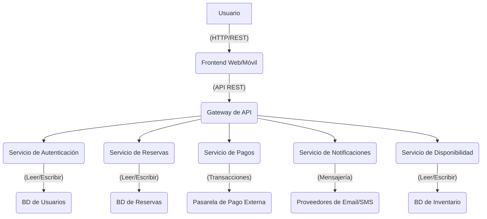

- **b. Diagrama de Arquitectura de Microservicios en Mermaid:** Crea un diagrama que muestre cómo se distribuirán los componentes del sistema en microservicios, destacando las dependencias y la comunicación entre ellos.

