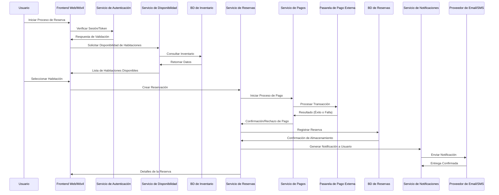

- **c. Diagrama de Secuencia UML:** Genera un diagrama de secuencia UML que detalle el flujo de interacciones en el sistema durante el proceso de reservación de una habitación. Este debe incluir la búsqueda de disponibilidad, selección de habitación, confirmación de la reserva, y el procesamiento del pago.

